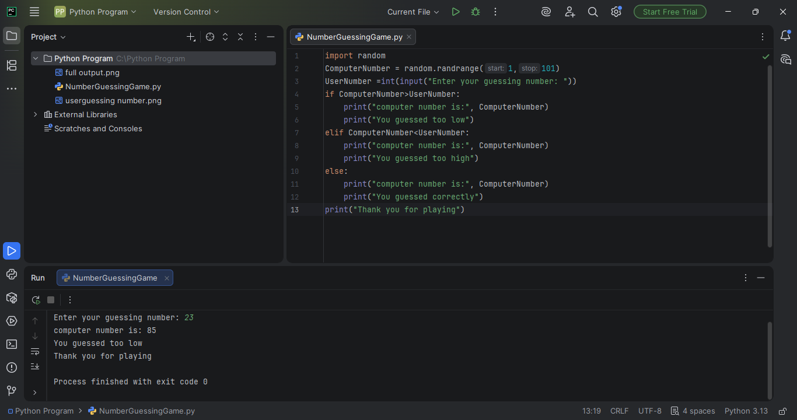

# Rock-Paper-Secissor-
Rock-Paper-Scissor game is descript how to broke after two item guessing. 3 item out of 1 item guess user and 3 out of 1 item guess computer,and this two item competition and one item broke another item,broke item is loss and another item is win,my this project 5 round in compitition.after 5 round final result declare user win or computer win
## Output

## Output

.png)

.png)
